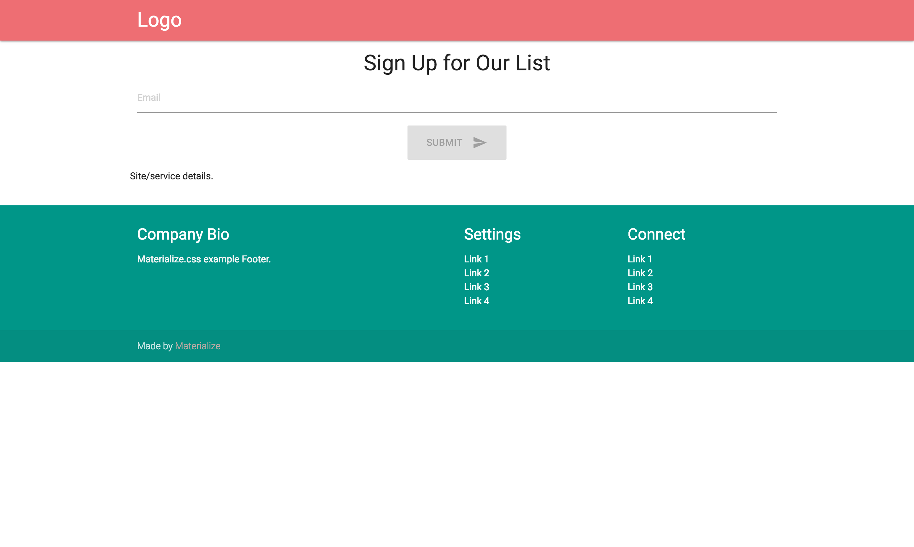

# Single Page Sign Up

I was pulling my hair out to create a simple sign up form with front and back end. Now that I've got it working, I want to share the setup with other devs. Let me know if you have improvements by submitting a Pull Request!




## To make a working development copy
You will need to do some setup, but it should be quick.

1. clone the repo (note that it includes the server and client)
2. cd into directory `cd singlepage_signup` and run `npm install`
3. cd into `cd client` and run `npm install`
4. Create an account on mLab or change the mongoose connection to a local mongodb
5. Create `/client/config/dev.js` with contents:
```
module.exports = {
    mongoURI: YOUR MLAB DEV ENVIRONMENT LINK,
    redirectDomain: 'http://localhost:3000'
};
```

## To run locally

It is simple, just run `npm run dev` in the main directory

## To deploy on heroku

1. Create an account on heroku
2. Create a production database on mLab
3. set up your MONGO_URI (your production database) and REDIRECT_DOMAIN (your site) on heroku

** Good luck**
